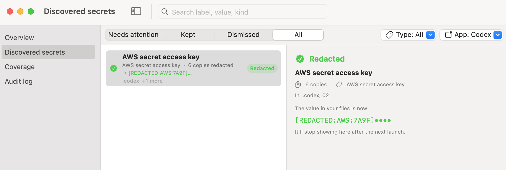

<p align="center">
  
</p>
<h1 align="center">Agent Scrub</h1>
<p align="center">Find and remove secrets stored in AI coding-agent history files.</p>

AI coding tools such as Claude Code, Codex, Cursor, and others store local conversation history, including
prompts, transcripts, and tool output. These files can sometimes contain API keys, tokens, and other secrets
in plaintext.

Agent Scrub scans these local history files, identifies potential secrets, and can redact them in place. All
scanning and redaction happens locally. No data is uploaded.

<p align="center">
  
</p>

Agent Scrub can detect and redact multiple copies of the same secret across an agent's history.

## Supported tools

- Claude Code
- Codex
- Gemini CLI
- Cursor
- GitHub Copilot
- Windsurf
- Cody
- Cline
- Aider
- Continue
- Pi
- VS Code forks that use the same chat storage format

## What it scans

Agent Scrub only scans conversation-related files, including:

- Prompts
- Transcripts
- Tool output
- Saved memory

It does not scan or modify configuration or credential files. Examples of files it will **not** touch:

- Codex `auth.json`
- Continue `config.yaml`
- Project `.env` files
- Editor secret storage
- Other files used by tools to store active credentials

This separation is intentional. A secret stored in a transcript is an additional copy of that secret.
Removing the transcript copy does not affect the credential the tool uses for authentication. Agent Scrub
only redacts copies found in conversation history — it does not modify active credentials.

If you want to inspect the potential impact of a leaked credential, you can also use
[geiger](https://github.com/puck-security/geiger), a read-only tool for checking what a credential may have
access to.

## Install

Requires macOS 14 or later.

### Download

Download the latest `AgentScrub-*.zip` from [GitHub Releases](../../releases/latest), unzip it, then run:

```sh
xattr -dr com.apple.quarantine AgentScrub.app
open AgentScrub.app
```

Agent Scrub is currently unsigned, so macOS may quarantine the downloaded app. The `xattr` command removes
that quarantine flag. You can also right-click the app and choose **Open → Open**.

Release builds are universal and support both Apple Silicon and Intel Macs.

### Build from source

Requires Xcode 16 and Swift 6.

```sh
./tools/app/bundle.sh
open .build/AgentScrub.app
```

## Permissions

On first launch, Agent Scrub may request access to Keychain and local files.

### Keychain

Agent Scrub creates a random per-install key and stores it in your login Keychain. This key is used to
fingerprint detected secrets so Agent Scrub's own database does not need to store secret values in plaintext.
It only accesses its own Keychain item. Choosing **Always Allow** prevents repeated Keychain prompts.

### Files

Agent Scrub needs permission to read the local history files created by supported coding agents. macOS may
show permission prompts for locations such as Documents, Desktop, or Downloads; these are required if agent
history is stored there. All processing remains local.

## Use

Agent Scrub runs from the macOS menu bar. It scans on launch and continues monitoring supported history
locations for changes.

**Overview** — detected secrets grouped by type, project, and application, along with lifetime totals.

**Discovered secrets** — each detected secret and the files where copies were found. Available actions:

- **Reveal** — show the detected value.
- **Decode JWT** — inspect the contents of a detected JWT.
- **Redact now** — replace detected copies with a `[REDACTED:…]` marker.
- **Always redact** — automatically redact the secret if it appears again.
- **Not a secret / Keep** — dismiss the finding or leave it unchanged.

**Coverage** — files or locations that could not be scanned and the reason they were skipped. You can also
exclude folders that you do not want Agent Scrub to scan.

## Redaction behavior

Redaction modifies the original history files and cannot be undone automatically. Before and after writing a
change, Agent Scrub re-checks and re-parses the affected file. Files that appear to be actively written by an
agent are skipped temporarily and retried after the session ends.

Agent Scrub can only remove local copies that still exist on your Mac. It cannot remove data that has already
been sent to a provider or copied into backups.

## Command line

`hgctl` provides command-line access to the same operations — scanning, redaction, verification, policies,
and enforcement. Write operations are dry runs by default unless `--yes` is provided.

```sh
swift run hgctl scan
```

## Your data

Agent Scrub does not make network connections. All scanning, state, and redaction remain on your Mac.

Application state is stored in `~/Library/Application Support/History Guard` (detected findings and your
keep/redact decisions), the fingerprinting key in your login Keychain, and excluded folders in application
preferences. To remove Agent Scrub completely, delete:

- The Agent Scrub application
- `~/Library/Application Support/History Guard`
- The `io.adversis.history-guard` Keychain item

## Development

Build and test:

```sh
swift build && swift test
```

To publish a release:

```sh
git tag v1.0.0
git push --tags
```

Pushing a version tag triggers CI to build the universal `.app` and publish it to GitHub Releases.
